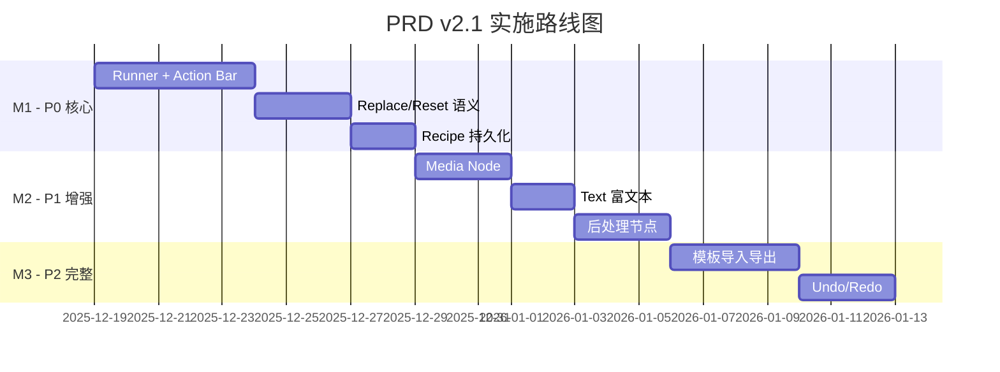
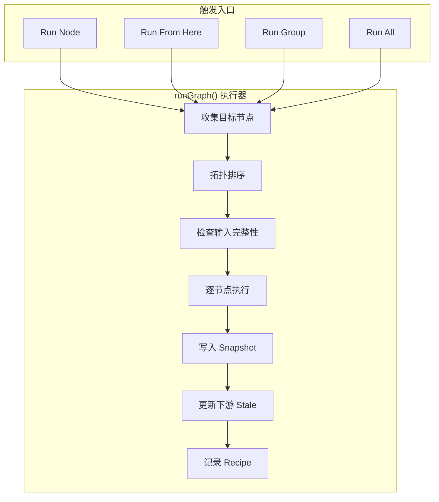
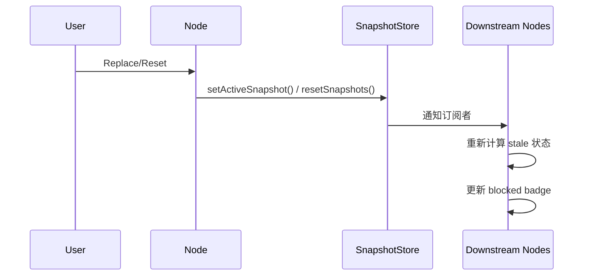

# PosterLab PRD v2.1

> 主题：Spaces 模式对齐优化 — 完整运行语义 + 节点 Action Bar + 输出管理 + 素材复用

- 版本：v2.1
- 日期：2025-12-18
- 目标读者：产品 / 设计 / 前后端
- 依赖前置：PRD v2.0（画布持久化 + 模板导入导出 + Typed Ports + DAG Runner + 结果墙）

---

## 0. 范围与原则

### 0.1 范围

**包含**

- 画布（Canvas）
- 节点（Node）
- 连线（Edge）
- 分组（GroupFrame）
- 文本节点（TextCard）
- 图片输入/生成/后处理（ImageCard / ImageStudio / Media / Upscale / Edit）
- 结果管理（Replace / Reset / Pin）
- 模板（Templates）
- 运行与回放（Recipe）

**不包含**

- 视频节点
- 多人协作
- 评论系统

### 0.2 目标

在交互与运行语义上，对齐 Freepik Spaces 的核心体验：

1. **节点级运行（Run）** — 单节点精确运行
2. **从此节点开始运行下游（Run from here）** — 级联运行下游子图
3. **节点级动作条（Action Bar）** — 统一动作入口
4. **节点级输出选择/替换/重置（Replace/Reset）** — 输出管理语义闭环
5. **素材复用（Media Node）** — 历史资产快速接入画布
6. **轻量文本节点体验（Text Node）** — 富文本编辑增强

---

## 1. 术语与对象模型

### 1.1 Node（节点）

**节点类型**

| 类型 | 说明 | 优先级 |
|------|------|--------|
| `Text` | 文本节点（Notes / Brief） | P0 |
| `ImageInput` | 图片上传输入 | P0 |
| `ImageStudio` | 图片生成（AI 驱动） | P0 |
| `Media` | 资产复用节点 | P1 |
| `RefSet` | 参考集 | P0 |
| `Style` | 风格组 | P0 |
| `Upscale` | 图片放大 | P1 |
| `Edit` | 图片编辑 | P1 |

**节点属性**

```typescript
interface Node {
  id: string
  type: NodeType
  position: { x: number; y: number }
  parentId?: string  // 所属 Group
  
  // 核心属性
  ports: TypedPorts       // 输入/输出端口
  params: SerializableParams  // 可序列化参数
  
  // 运行态
  runtime: {
    status: 'idle' | 'running' | 'success' | 'error' | 'blocked'
    activeOutput?: string        // 当前激活输出 snapshot id
    outputs: SnapshotRef[]       // 输出列表
    lastRunAt?: string           // 最后运行时间
    error?: string               // 错误信息
  }
}
```

### 1.2 Snapshot（输出快照）

作为节点输出的**唯一事实来源**（Single Source of Truth）：

- 每个输出 port 允许多个版本（历史记录）
- 新增：`activeSnapshotId` — 每个输出 port 仅一个"当前激活输出"

```typescript
interface Snapshot {
  id: string
  producerId: string    // 产出节点 ID
  portKey: string       // 输出端口 key
  version: number       // 版本号
  payload: unknown      // 输出数据
  isActive: boolean     // 是否为激活输出
  createdAt: string
}
```

### 1.3 Run（运行）

一次运行 = 一个 `run_id`（可复用 recipes 表）

**触发模式**

| 模式 | 说明 | 入口 |
|------|------|------|
| `RUN_NODE` | 仅当前节点 | 节点 Action Bar |
| `RUN_FROM_HERE` | 当前 + 下游子图 | 节点 Action Bar |
| `RUN_GROUP` | Group 内子图 | GroupFrame Header |
| `RUN_ALL` | 全图 | 顶栏 Run All |

---

## 2. 功能需求

### P0：必须做（核心复刻）

#### 2.1 Runner 真执行（DAG）

**需求**

实现统一执行器：`runGraph({ startNodeId, mode })`

支持三种运行模式：

| 模式 | 行为 |
|------|------|
| Run Node | 只执行该节点（仅当输入齐全） |
| Run from here | 执行该节点及其所有可达下游节点（拓扑顺序） |
| Run group | 仅执行 group 内子图（按 group 边界裁剪） |

**执行规则**

1. 每个节点必须实现 `execute(ctx)`，输入来自订阅的 active snapshots
2. 节点执行成功 → `createSnapshot()` 写入输出，更新 `activeSnapshotId`
3. 节点执行失败 → `runtime.status = 'error'`，输出不更新

**输入齐全判定**

- 对每个节点定义 required inputs（按 `NODE_PORTS` + 节点类型补充）
- 缺输入：Run 按钮 disabled + tooltip 显示缺哪几个 port

**验收**

- [ ] 任意节点点 Run：只跑自己
- [ ] 任意节点点 Run from here：跑完整下游链路，且顺序正确
- [ ] 中间节点改输入后，下游 stale 自动生效并提示重新运行

---

#### 2.2 节点 Action Bar（统一动作入口）

**需求**

选中节点时在节点顶部显示 Action Bar（悬浮条），动作集合按节点类型变化（Schema 驱动）。

**通用动作（所有节点）**

| 动作 | 图标 | 说明 |
|------|------|------|
| Rename | ✏️ | 重命名节点 |
| Duplicate | 📄 | 复制节点 |
| Delete | 🗑️ | 删除节点 |
| Lock/Unlock | 🔒/🔓 | 禁止拖拽、禁止编辑 params |
| Change Color | 🎨 | 节点背景色标签 |

**生成类节点（ImageStudio / ImageCard(studio)）**

| 动作 | 图标 | 说明 |
|------|------|------|
| Run | ▶️ | 执行当前节点 |
| Run from here | ⏩ | 从此节点开始运行下游 |
| Replace creation | 🔄 | 选择某个结果为 active 输出 |
| Reset creation | 🔃 | 清空 outputs + 清 stale |
| Open preview | 👁️ | 打开 Lightbox/ResultWall 预览 |

**输入类节点（ImageInput / Media）**

| 动作 | 图标 | 说明 |
|------|------|------|
| Replace input | 📷 | 替换当前输入图 |
| Reset input | ❌ | 清空 |

**验收**

- [ ] 用户不打开 Inspector，也能完成：运行、预览、替换、重置、复制、删除

---

#### 2.3 Replace / Reset 的"节点语义闭环"

**需求**

| 操作 | 行为 |
|------|------|
| Replace creation | 将某个候选结果设为输出 port 的 `activeSnapshotId` |
| Reset creation | 清空节点该输出 port 的 snapshots（或标记为 archived），`activeSnapshotId` 置空 |

> [!IMPORTANT]
> **Reset 语义传播**：Reset 后，所有订阅该输出的下游节点必须变为 `stale/blocked`（视是否有替代输入）

**验收**

- [ ] Replace 后，下游节点输入立即切换到新的 active 输出（无需重连线）
- [ ] Reset 后，下游输入消失并提示缺输入

---

#### 2.4 Recipe 持久化闭环（运行记录可回放）

**需求**

每次 run 创建 recipes 记录：

```typescript
interface Recipe {
  run_id: string
  mode: 'RUN_NODE' | 'RUN_FROM_HERE' | 'RUN_GROUP' | 'RUN_ALL'
  start_node_id: string
  affected_node_ids: string[]
  timestamp: string
  
  // 每个 executed node 的 IO 映射
  node_io_map: Record<string, {
    inputs: SnapshotRef[]
    outputs: SnapshotRef[]
  }>
}
```

**Recipe Chip 支持回放**

- 回放 = 恢复当时每个输出 port 的 `activeSnapshotId`（不重新生成）
- 恢复后触发 stale 重新计算

**验收**

- [ ] 任意 run 后能在列表里看到 recipe
- [ ] 点击回放能恢复画布"当时的结果选择状态"

---

### P1：应做（对齐手感）

#### 2.5 Media Node（资产复用节点）

**需求**

新增 MediaCard：

- 支持从 AssetsDrawer 选择历史图片（生成结果、上传图片、收藏图片）
- 输出 `imageOut`
- 支持一键 "Save to Assets"（在 ResultWall/Action Bar）

**验收**

- [ ] 可以不用 Upload，直接把历史图拖进画布复用并连线

---

#### 2.6 TextCard 升级为轻量富文本

**需求**

Notes 模式支持：

- 标题 / 加粗 / 列表 / 链接 / 代码块（最小集）

Action Bar 增加 `Open preview`（只读预览）

输出 `textOut`（可选，P1 可先不接入）

**验收**

- [ ] Text 节点可以当流程注释使用，编辑体验明显优于 textarea

---

#### 2.7 图片后处理节点（最小版）

> [!TIP]
> 先做"有节点位 + 能串联"，别急着做复杂编辑器

**UpscaleCard（最小）**

- 输入 `imageIn` → 输出 `imageOut`
- 调用 `/api/generate/image` 的 upscaler 模型能力（或单独端点）

**EditCard（最小）**

- 输入 `imageIn` → 输出 `imageOut`
- 支持至少 1 种编辑（裁剪或背景移除），可跳转到独立编辑页实现

---

### P2：可后做（完整复刻）

#### 2.8 Templates 导入导出完整实现

**需求**

**Export**

- 导出 `project_graphs.nodes/edges/viewport` + templates meta

**Import**

- ID remap（nodeId、edgeId、groupId、assetId）
- 可选：将模板绑定示例素材映射为占位（导入后提示补齐）

**"Use template"**

- 创建新 project 并导入 graph

**验收**

- [ ] 任何 project 可导出 JSON
- [ ] 导入 JSON 可完整还原画布结构与节点内容

---

#### 2.9 Undo / Redo（画布级）

**需求**

接入 graphStore 的历史栈，覆盖操作：

- 拖拽
- 连线
- 删节点
- 改 params
- replace/reset
- group resize

**验收**

- [ ] 关键操作可撤销/重做，状态一致且不破坏 subscriptions

---

## 3. 交互与 UI 规范

### 3.1 Action Bar 触发

| 场景 | 行为 |
|------|------|
| 选中单节点 | 显示 Action Bar |
| 多选 | 显示多选动作（Duplicate/Delete/Group） |
| Lock 状态 | 显示锁 icon，禁止拖拽 |

### 3.2 运行状态显示

| 状态 | 视觉反馈 |
|------|---------|
| `running` | 节点边框/角标显示加载态（旋转动画） |
| `done/success` | 显示 `lastRunAt` |
| `error` | 显示错误 icon，hover 显示 error message |

### 3.3 缺输入提示

- 被阻塞节点显示 `blocked` badge
- 点击 Run 时如果缺输入：toast + 在缺口 port 高亮闪烁

---

## 4. 数据与接口改动

### 4.1 SnapshotStore 扩展

新增：

```typescript
interface SnapshotStore {
  // 新增
  activeByProducerPort: Record<`${producerId}:${portKey}`, snapshotId>
  
  // 新增方法
  setActiveSnapshot(producerId: string, portKey: string, snapshotId: string): void
  resetSnapshots(producerId: string, portKey: string): void
}
```

### 4.2 recipes 表字段补齐

如缺少以下字段需补充：

| 字段 | 类型 | 说明 |
|------|------|------|
| `start_node_id` | TEXT | 起始节点 ID |
| `mode` | TEXT | 运行模式 |
| `affected_node_ids` | JSON | 受影响节点 ID 列表 |
| `node_io_map` | JSON | 节点 IO 映射 |

### 4.3 Jobs 状态联动

- Runner 调度时创建 job，完成后写 snapshot 并 setActive

---

## 5. 验收清单（Definition of Done）

### P0 DoD

| # | 验收项 | 状态 |
|---|--------|------|
| 1 | Run / Run from here 正常工作，拓扑正确，错误可见 | ⬜ |
| 2 | Action Bar 覆盖核心动作 | ⬜ |
| 3 | Replace/Reset 对下游订阅生效 | ⬜ |
| 4 | 每次运行记录 recipe，支持回放恢复 active 输出 | ⬜ |

### P1 DoD

| # | 验收项 | 状态 |
|---|--------|------|
| 1 | Media Node 可复用历史资产并可连线 | ⬜ |
| 2 | Text 节点支持富文本最小集 | ⬜ |
| 3 | Upscale 或 Edit 至少一个后处理节点可串联 | ⬜ |

### P2 DoD

| # | 验收项 | 状态 |
|---|--------|------|
| 1 | 模板导入导出闭环 | ⬜ |
| 2 | Undo/Redo 覆盖主要操作 | ⬜ |

---

## 6. 里程碑（Milestones）



### M1（P0）：Runner + Action Bar + Replace/Reset + Recipe 持久化

**目标**：完成核心运行语义

- Runner DAG 执行器实现
- 节点 Action Bar 组件
- Replace/Reset 语义与 subscription 联动
- Recipe 记录与回放

### M2（P1）：Media Node + Text 富文本 + 后处理节点

**目标**：增强节点类型

- Media Node 资产复用
- TextCard 富文本编辑
- UpscaleCard / EditCard 最小实现

### M3（P2）：模板导入导出 + Undo/Redo

**目标**：完整工作流支持

- 模板完整导入导出
- 画布级 Undo/Redo

---

## 7. 技术实现要点

### 7.1 Runner 架构



### 7.2 Action Bar Schema

```typescript
const ACTION_BAR_SCHEMA: Record<NodeType, ActionDefinition[]> = {
  // 所有节点通用
  '*': [
    { id: 'rename', label: 'Rename', icon: 'pencil' },
    { id: 'duplicate', label: 'Duplicate', icon: 'copy' },
    { id: 'delete', label: 'Delete', icon: 'trash' },
    { id: 'lock', label: 'Lock', icon: 'lock', toggle: true },
    { id: 'color', label: 'Color', icon: 'palette' },
  ],
  
  // 生成类节点
  ImageStudio: [
    { id: 'run', label: 'Run', icon: 'play', primary: true },
    { id: 'runFromHere', label: 'Run from here', icon: 'forward' },
    { id: 'replace', label: 'Replace', icon: 'swap' },
    { id: 'reset', label: 'Reset', icon: 'refresh' },
    { id: 'preview', label: 'Preview', icon: 'eye' },
  ],
  
  // 输入类节点
  ImageInput: [
    { id: 'replace', label: 'Replace', icon: 'image' },
    { id: 'reset', label: 'Reset', icon: 'x' },
  ],
  
  // ... 其他节点类型
}
```

### 7.3 Stale 传播机制



---

## 8. 开放问题（Open Questions）

1. **Run from here vs Run to here**：是否需要"向上补跑"的变体？
2. **批量操作**：多选节点时是否支持批量 Run？
3. **并发控制**：同一节点多次 Run 如何处理？排队还是取消前一个？
4. **Locked 节点**：Lock 状态是否阻止所有修改还是仅阻止拖拽？
5. **Reset 范围**：Reset 是清空所有历史还是仅当前版本？

---

## 附录 A：与 PRD v2.0 的差异

| 方面 | v2.0 | v2.1 |
|------|------|------|
| 运行入口 | 仅 Group 级别 | 增加节点级 Run/Run from here |
| 动作入口 | 分散在各处 | 统一 Action Bar |
| 输出管理 | 基础 Pin | Replace/Reset 语义闭环 |
| 新增节点 | - | Media/Upscale/Edit |
| 富文本 | 基础 textarea | 轻量富文本编辑器 |
